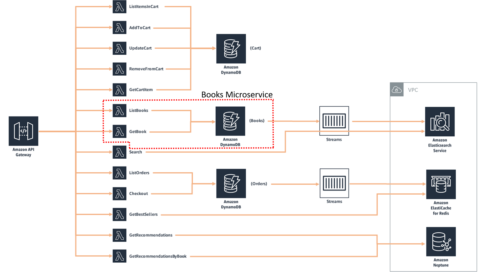

## AWS DevOps End-to-End Workshop

AWS DevOps End-to-End Workshop is a guide to walk you through the most common development activities when developing a typical web application with front-end, microservices in a serverless architecture, and a DynamoDB database as a data store. It modifies templates on [AWS Bookstore Demo App](https://github.com/aws-samples/aws-bookstore-demo-app). Visit this link to get detailed information on the application features, architecture, services, and code.

The application is a book store for customers to shop for fictitious books. [You can try out the deployed application here](https://d2h3ljlsmzojxz.cloudfront.net/) to explore it's features: you can browse and search for books, look at recommendations and best sellers, manage your cart, checkout, view your orders, and more.  

The application is created using a single CloudFormation template, which is great for simplify deployment, as the original purpose was having it up and running. Our goal is to allow you to take the next step: be the developer to evolve the application!

Some common questions here start with the Development Lead: how can I standardize Cloud9 IDE for my developers, so all of them have the same environment?  In this workshop we use a modified version of [AWS Cloud9 Bootstrapping Example](https://github.com/aws-samples/aws-cloud9-bootstrapping-example) to accomplish that.

Developers beginning to use AWS DevOps practices and tools need to know some basics, but not always trivial, steps. They need answers to questions as:

- How should I use Cloud9 as the IDE for making changes and commit those for a specific microservice?
- How this service could be maintained independently from the rest of the application?
- Which are the steps needed to automate CI/CD for that microservice? 
- How unit tests could be implemented?

This workshop answers these and other questions developers have to be productive while adopting DevOps practices.

Let's get started with building your own application below!
&nbsp;

## License Summary

This sample code is made available under a modified MIT license. See the LICENSE file.

&nbsp;

## Outline

- [Overview](#overview)
- [Architecture](#architecture)
- [Instructions](#instructions)
  - [Getting started](#getting-started)
  - [Use Cloud9 environment to maintain your application](#use-cloud9-environment-to-maintain-your-application)
  - [Implementing CI/CD pipeline for the Books microservice](#implementing-cicd-pipeline-for-the-books-microservice)
  - [Automate unit test for ListBooks lambda function](#automate-unit-test-for-listbooks-lambda-function)
  - [Some challenges if you have time...](#some-challenges-if-you-have-time)
  - [Cleaning up](#cleaning-up)
- [Known limitations](#known-limitations)

&nbsp;

## Overview

The goal of AWS Bookstore Demo App is to provide a fully-functional web application that utilizes multiple purpose-built AWS databases and native AWS components like Amazon API Gateway and AWS CodePipeline. Increasingly, modern web apps are built using a multitude of different databases. Developers break their large applications into individual components and select the best database for each job. Let's consider AWS Bookstore Demo App as an example. The app contains multiple experiences such a shopping cart, product search, recommendations, and a top sellers list. For each of these use cases, the app makes use of a purpose-built database so the developer never has to compromise on functionality, performance, or scale. 

The provided CloudFormation template automates the entire creation and deployment of AWS Bookstore Demo App.  The template includes the following components:

**Database components**

* Product catalog/shopping cart - Amazon DynamoDB offers fast, predictable performance for the key-value lookups needed in the product catalog, as well as the shopping cart and order history.  In this implementation, we have unique identifiers, titles, descriptions, quantities, locations, and price.
* Search - Amazon Elasticsearch Service enables full-text search for our storefront, enabling users to find products based on a variety of terms including author, title, and category.
* Recommendations - Amazon Neptune provides social recommendations based on what user's friends have purchased, scaling as the storefront grows with more products, pages, and users.
* Top sellers list - Amazon ElastiCache for Redis reads order information from Amazon DynamoDB Streams, creating a leaderboard of the “Top 20” purchased or rated books.

**Application components**

* Serverless service backend – Amazon API Gateway powers the interface layer between the frontend and backend, and invokes serverless compute with AWS Lambda.  
* Web application blueprint – We include a React web application pre-integrated out-of-the-box with tools such as React Bootstrap, Redux, React Router, internationalization, and more.

**Infrastructure components**

* Continuous deployment code pipeline – AWS CodePipeline and AWS CodeBuild help you build, test, and release your application code. 
* Serverless web application – Amazon CloudFront and Amazon S3 provide a globally-distributed application. 

In a real development team, however, we need to create separated pipelines and stacks, so each service could be built and released independently from each other. This modified version adds a second template (and stack) for Books microservice, which contains just the lambda functions related to books: GetBook and ListBooks. To separate from the original, we faced the need of passing values between templates. We implemented it by using [outputs](https://docs.aws.amazon.com/AWSCloudFormation/latest/UserGuide/outputs-section-structure.html) and [imports](https://docs.aws.amazon.com/AWSCloudFormation/latest/UserGuide/intrinsic-function-reference-importvalue.html). A better alternative could be to use Parameter Store, reducing the templates dependency. It's a challenge for you if you have additional time.  

You can choose to customize the templates to create your own bookstore, modify it to make a different type of store, or change it to make a completely different type of web application.  

AWS Bookstore Demo App is built on-top of **[AWS Full-Stack Template](https://github.com/awslabs/aws-full-stack-template)**, which provides the foundational services, components, and plumbing needed to get a basic web application up and running. Users can build on top of AWS Full-Stack Template to create any application they envision, whether a travel booking tool, a blog, or another web app.  This AWS Bookstore Demo App is just one example of what you can create using AWS Full-Stack Template. 

Watch the recorded talk and demo of the original application [here](https://youtu.be/-pb-DkD6cWg?t=1309). 
&nbsp;

## Architecture

The solution architecture is the same as the original.  The diagram below shows the scope of our Books microservice.



&nbsp;

## Instructions

***IMPORTANT NOTE**: Creating this demo application in your AWS account will create and consume AWS resources, which **will cost money**.  We estimate that running this demo application will cost ~**$0.45/hour** with light usage.  Be sure to shut down/remove all resources once you are finished to avoid ongoing charges to your AWS account (see instructions on cleaning up/tear down below).*

&nbsp;

### Getting started

To get AWS Bookstore Demo App up and running in your own AWS account, follow these steps (if you do not have an AWS account, please see [How do I create and activate a new Amazon Web Services account?](https://aws.amazon.com/premiumsupport/knowledge-center/create-and-activate-aws-account/)). You'll have to create two stacks, as we intend to update the Books microservice independently of the rest of the application - as if you have a development team responsible for the Books product (our microservice).

#### Get the code you need
Download all files in this repository to your local disk.

#### Go to the Console

1. Log into the [AWS console](https://console.aws.amazon.com/) if you are not already.  
*Note: If you are logged in as an IAM user, ensure your account has permissions to create and manage the necessary resources and components for this application.* 
2. Choose the AWS region you want to create your application. AWS Bookstore Demo App is supported in the following regions:

Region name | Region code 
--- | --- 
US East (N. Virginia) | us-east-1 
US West (Oregon) |	us-west-2 
EU (Ireland) |	eu-west-1 
EU (Frankfurt) |	eu-central-1 

#### Create the front-end and lambda functions not related to Books microservice

1. In CloudFormation, choose **Create Stack** with New resources 
   - Under **Specify template**, select **Upload a template file** and look for DemoBookstoreMainTemplate.yml.  Select **Next**
   - Name the stack (for example, DemoBookStoreStack)
   - Set parameter ProjectName = demobookstore (this is the default)
   - In the review page, check the “**I acknowledge…**” check box, and create the stack
2. Once the CloudFormation deployment is complete (it could take around 25 minutes), check the status of the build in the [CodePipeline](https://console.aws.amazon.com/codesuite/codepipeline/pipelines) console and ensure it has succeeded

#### Create the Books microservice

1. In CloudFormation, choose **Create Stack** with New resources 
   - Under **Specify template**, select **Upload a template file** and look for DemoBookstoreBooksServiceTemplate.yml.  Select **Next**.
     - **DO NOT** select DemoBookstoreBooksService**Update**Template.yml. If you do, it'll fail.
   - Name the stack (for example, DemoBooksServiceStack).
   - Set parameter ProjectName to the same value you choose previously. This guide assumes you choose the default value on both (demobookstore).
   - Create the stack.

#### Test your application

1. Get the web site URL from **WebApplication** output on DemoBookStoreStack stack details page on CloudFormation. Open the link in your browser.
2. You can sign into your application by registering an email address and a password.  Choose **Sign up to explore the demo** to register.  The registration/login experience is run in your AWS account, and the supplied credentials are stored in Amazon Cognito.
   *Note: given that this is a demo application, we highly suggest that you do not use an email and password combination that you use for other purposes (such as an AWS account, email, or e-commerce site).*
3. Once you provide your credentials, you will receive a verification code at the email address you provided. Upon entering this verification code, you will be signed into the application.


***NOTE**: Up to now, you have exactly the same results you would if you have run the original sample, but creating two stacks. Now your application is running, consider you have two developers in charge of maintaining the application: one for the Books microservice; and the other for the front-end and the other microservices. You also have a Development Lead responsible for guarantee the developers have the same IDE, avoiding issues with packages' versions, as Python, for example. The next sessions will walk you through some of the tasks and challenges they'll face!*


&nbsp;


### Use Cloud9 environment to maintain your application

#### Create an environment (IDE) for Cloud9

1. Create another stack from C9EnvironmentTemplate.yml. Name your stack as C9EnvironmentStack, for example.
   - In the review page, check the “**I acknowledge…**” check box, and create the stack
2. Go to Cloud9 and open your IDE.

Note: the difference between this template and the original from [AWS Cloud9 Bootstrapping Example](https://github.com/aws-samples/aws-cloud9-bootstrapping-example) is the inclusion of some statements to update Python to 3.8.8 and maiking it the default version.

#### Create CodeCommit repositories

1. On CodeCommit, check you have a demobookstore-WebAssets repository with all code for the front-end. This repository was created for you when creating DemoBookStoreStack.
2. Create a repository for the Books microservice 
   
   - Create an empty demobookstore-BooksService repository on CodeCommit. You will populate it next.
3. Clone repositories in Cloud9
   - Repository demobookstore-WebAssets (front-end and services other than related to Books)
     - Copy repository URL on CodeCommit for demobookstore-WebAssets
     - In Cloud9 command prompt, run 
       ```
       git clone <paste here the demobookstore-WebAssets URL>
       ```
   - Repository demobookstore-BooksService (for Books microservice with lambda functions related to books)
     - Copy repository URL on CodeCommit for demobookstore-BooksService, that you created on step 2
     - In Cloud9 command prompt, run 
       ```
       git clone <paste here the demobookstore-BooksService URL>
       ```
     - In Cloud9 Environment tab on navigation, there will be one folder for each of these repositories. Select the folder demobookstore-BooksService and create a subfolder named src
     - Select AWS tab on navigation in Cloud9, find the lambda function demobookstore-GetBook, and import it under demobookstore-BooksService/src. If the list of services in this tab doesn't open, close and reopen Cloud9
     - Repeat previous step for demobookstore-ListBooks function
     - In the Source Code tab in the navigation, commit your code (insert a description and type Ctrl+Enter). If you get a message asking if you want to automatically stage changes and commit, click Always. Right click the menu on demobookstore-BooksService and push the changes to the repository (this can also be done by clicking 0↓1↑ or the small cloud symbol in the bottom-left corner)
     - Check your code is at CodeCommit repository

#### Change code on front-end

Make a change in demobookstore-WebAssets and check if the pipeline running.

1. Using Cloud9:
   - Make some code change. For example, change some fixed text, as in  src/modules/signup/Home.tsx, under renderLanding, you can change the heading from “Bookstore Demo” to “Bookstore FANTASTIC Demo”
   - Save, commit and push the code as you did previously
2. Open CodePipeline and check demobookstore-Assets-Pipeline running. This pipeline was created for you when creating DemoBookStoreStack. It will take around 6 minutes to finish. Notice there isn’t a Deploy stage. The deployment is made on Build stage, as the deployment of a web application (front-end) is done by copying the files to the S3 bucket (take a look on it after the pipeline has finished – you’ll see an executable version of your application, not the source code, which is in CodeCommit repository)
3. Test your web application by refreshing it from the browser (Ctrl+F5 on Firefox). If you did the suggested change above, click Log out and then the "Bookstore" logo to go to the landing page, and check the title


### Implementing CI/CD pipeline for the Books microservice

#### Add build and service update YAML files

1. In Cloud9, upload buildspec.yml and DemoBookstoreBooksServiceUpdateTemplate.yml files, to folder demobookstore-BooksService
   - buildspec.yml has building instructions. It also has testing instructions which will be used to run the automated tests. They are commented at this point, and will be used later
   - DemoBookstoreBooksServiceUpdateTemplate.yml is an updated version of DemoBookstoreBooksServiceTemplate.yml, to be used in the deployment stage of the pipeline. The definitions of ListBooks and GetBook functions were changed so they are modified on every pipeline execution (CodeUri property), to allow CloudFormation to detect changes update the stack 
2. Commit and push

#### Create a S3 bucket for build pipeline

1. Name must be globally unique: demobookstore-books-service-pipeline-bucket-< YYYYMMDDHHMM >, for example. If it exists, try another name
2. Uncheck “**Block all public access**” and check the “I acknowledge…” check box. Note: this is a demo environment. Carefully consider security concerns for production
3. Leave all other options as default

#### In IAM, create a role for CloudFormation deployment

1. For simplicity, under **Attach permissions policies**, select AdministratorAccess
2. Role name = demobookstore-CloudFormation-role

#### Create a new pipeline for automating Books microservice build and deploy

1. Choose a name for your pipeline, as demobookstore-BooksService-Pipeline, for example. Leave all other options as default
2. Create the Source stage as:
   - Source provider = AWS CodeCommit
   - Repository name = demobookstore-BooksService
   - Branch name = main (or master, depending on which one is available)
   - Leave the other options as they are
3. Create the Build stage as:
   - Build provider = AWS CodeBuild
   - Click on Create Project button to be redirected to create a build project
     - Project name = demobookstore-BooksService-BuildProject
     - Operating system = Amazon Linux 2
     - Runtime = Standard
     - Image = aws/codebuild/amazonlinux2-x86_64-standard:3.0
     - (New service role) Role name = demobookstore-BooksService-BuildProject-service-role
     - Timeout = 10 minutes
     - Environment variables:
       - S3_BUCKET = demobookstore-books-service-pipeline-bucket-< YYYYMMDDHHMM >
       - APP_ID = demobookstore-BooksService-BuildProject
       - ACCOUNT_ID  = < your account id >
       - PARTITION = aws
     - Logs
       - Check “S3 logs – optional” check box
       - Bucket = demobookstore-books-service-pipeline-bucket-< YYYYMMDDHHMM >
     - Leave all other fields as they are and hit “Continue to CodePipeline”, to go back to CodePipeline creation
   - In IAM, attach policy “AdministratorAccess” to role demobookstore-BooksService-BuildProject-service-role
4. Create the Deploy stage as:
   - Deploy provider = AWS CloudFormation
   - Action mode = Create or replace a change set
   - Stack name = DemoBooksServiceStack (or another name you’ve chosen)
   - Change set name = pipeline-changeset
   - Template -> Artifact name = BuildArtifact
   - Template -> File name = template-export.yml
   - Capabilities: select CAPABILITY_NAMED_IAM and CAPABILITY_AUTO_EXPAND
   - Role name: demobookstore-CloudFormation-role
   - Advanced -> Parameter overrides = {"AppId":"demobookstore-BooksService", "ProjectName":"demobookstore"}
   - Create the pipeline and check if it runs and all steps are green after a while. Click the details link in the Deploy stage. You should see a change set with four changes (Books microservice objects)
5. Modify the Deploy stage to add an action group to execute the change set:
   - Edit Deploy action and set:
      - Action name = GenerateChangeSet
      - Output artifacts = GenerateChangeSetArtifacts (or another name you prefer)
   - Add an action group as: 
     - Action name = ExecuteChangeSet
     - Action provider = AWS CloudFormation
     - Input artifacts = <the same you choose in GenerateChangeSet -> Output artifacts>
     - Action mode = Execute a change set
     - Stack name = DemoBooksServiceStack (or another name you’ve chosen)
     - Change set name = pipeline-changeset
     - Leave all other fields as they are hit “Done”
6. Test your microservice in Cloud9
   - Make a change in ListBooks function, including something in the log, as console.log(“I’m in ListBooks”)
   - Save, commit and push
   - Check if the pipeline run (all steps green)
   - As the deployment package is larger than 3MB, due to node modules, you'll not be able to see the Lambda function code using AWS Console
   - Refresh the web application and navigate to the home page (log in if you’re not). ListBooks is called to fill the items in “Cookbooks” category on home page
   - In your lambda function, under Monitor, click the CloudWatch link and check if your message (“I’m in ListBooks”) is in the log. **You’ve just instrumented your lambda function!**


### Automate unit test for ListBooks lambda function

1. Upload package.json, which sets jest as the framework for testing
2. Enable build to run unit tests
   - In buildspec.yml, uncomment commands `- npm run test` and `- rm -rf ./__tests__`
2. Unzip __tests__.zip in your local disk and upload __tests__ folder under demobookstore-BooksService
3. Save, commit, and push
4. In CodePipeline, open your books service pipeline (demobookstore-BooksService-Pipeline), wait for it to complete, and click “details” on Build stage. Check the messages indicating the test was successfully run


### Some challenges if you have time...

#### Make your solution secure

Configure demobookstore-CloudFormation-role to have minimum permissions. Review other roles and check if the permissions are the most restrictive as possible. Don't forget to test after each change!

#### Eliminate dependency among CloudFormation stacks

The method for exchange information from the main to Books stack is based on outputs & imports in the templates. It adds dependency between those stacks. Replace this by using Parameter Store service.

#### Create a Cart microservice

Use Books microservice as an example for taking Cart functions out of the DemoBookstoreMainTemplate.yml template.

#### Use VS Code as IDE

It's an alternative to Cloud9.


### Cleaning up

To tear down your application and remove all resources associated with AWS Bookstore Demo App, follow these steps:

1. Log into the [Amazon S3 Console](https://console.aws.amazon.com/s3) and  delete the buckets created for the demo app.  
   - There should be two buckets created for AWS Bookstore Demo App.  The buckets will be titled "X" and "X-pipeline", where "X" is the name you specified in the CloudFormation wizard under the AssetsBucketName parameter.
   - Also delete the S3 bucket for build pipeline: demobookstore-books-service-pipeline-bucket-< YYYYMMDDHHMM >.  
   - *Note: Please be **very careful** to only delete the buckets associated with this app that you are absolutely sure you want to delete.*
2. Log into the AWS CloudFormation Console and find the stacks you created for the demo app.
3. Delete the DemoBooksServiceStack stack.
4. Delete the DemoBookStoreStack stack. This removal could take more than 90 minutes, and fail. If this happen, delete it again and you'll get a message with some resources you should manually delete. Delete the VPC: it'll ask you to delete two network interfaces. Delete them and then the VPC. Continue deleting the stack. It should complete in few seconds.
5. Delete the roles you created: demobookstore-CloudFormation-role and demobookstore-BooksService-BuildProject-service-role.

*Remember to shut down/remove all related resources once you are finished to avoid ongoing charges to your AWS account.*


## Known limitations

These are the same known limitations in the original web application. Note that the application was written for demonstration purposes and not for production use.

There are some network errors observed on Firefox.  We are looking into this.

&nbsp;&nbsp;


